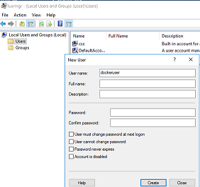
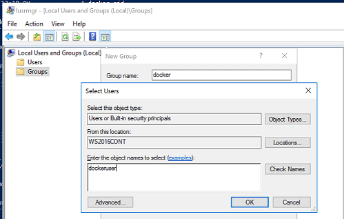

# Building Windows Server Contianers with VSTS

## Approach 1: Run your own agent

* Install the [Docker Extension for VSTS](https://marketplace.visualstudio.com/items?itemName=ms-vscs-rm.docker) 
* Agent needs to be WS2016. Start with the Windows Server 2016 With Containers image from the Azure Marketplace. 
<a href="https://portal.azure.com/#create/Microsoft.Template/uri/https%3A%2F%2Fraw.githubusercontent.com%2Fxtophs%2Fvsts-building-windows-server-containers%2Fmaster%2Fscripts%2Fazuredeploy.json" target="_blank">

</a>
* [Configure Docker Security](https://docs.microsoft.com/en-us/virtualization/windowscontainers/manage-docker/configure-docker-daemon#configure-docker-on-the-docker-service) on the Host. By default, you need administrator privileges to communicate with the docker engine. 
If you're running the VSTS agent under the default NETWORK SERVICE account, you'll get an error like: `Warning: failed to get default registry endpoint from daemon (error during connect: Get http://%2F%2F.%2Fpipe%2Fdocker_engine/v1.25/info: open //./pipe/docker_engine: Access is denied.).`

Instead of running the agent with admin rights, you could run under a local user and configure group access for the docker engine. 

1. Create a local user (for example using `lusrmgr.msc`)


2. Create a local group called docker with that user



3. Create `c:\programdata\docker\config\daemon.json`


4. Add 
```
{
   "group" : "docker"
}
```

5. Restart the Docker Service, e.g. from Powershell
```
Restart-Service Docker
```
6. [Confgure the VSTS Agent](https://www.visualstudio.com/en-us/docs/build/actions/agents/v2-windows#download-and-configure-the-agent). Make sure you run the service under the local user we created above. 

Now VSTS ready to build Windows Containers using the Build an Image step from the Docker Extension

## Approach 2: Connect to a Docker Host

<i>Still under investigation</i>

## Note
You have to run onthe VSTS agent on a VM when you're looking to execute docker commands (docker build, docker push, etc. ). You can not run the container based agent from https://github.com/Microsoft/vsts-agent-docker/tree/windows because executing docker commands would require running docker in docker, which is not supported in Windows at the time of writing.

